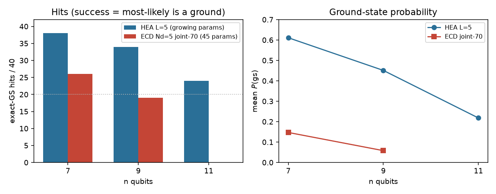

# HEA vs ECD Gibbs size sweep

Question: ECD \(N_d=5\) has a **fixed** 40 ECD + 5 product-state prep parameters
as the Fock cutoff grows. HEA \(L=5\) has \(n(L+1)\) parameters. Does ECD catch
HEA as \(n\) grows on this diagonal knapsack / Ising class?

**No.** Under this protocol HEA still wins at every size where both ran.
Size does not create an ECD win here. Nothing was retuned to force an ECD
result.

n=7 numbers are stored (not rerun). n=9/11 instances are **new** files
(`hamiltonians_n9.json`, `hamiltonians_n11.json`) using the same recipes as
the n=7 mixed suite: 20 random knapsacks (integer values/weights, slack-faithful
\(\lambda\)) + 20 diagonal Ising (all local \(Z\) + 12 random \(ZZ\),
RMS-normalized). No QAOA. `eta.py` and the n=7 suite JSON were not edited.

## Protocol

| Item | Setting |
|---|---|
| Embedding | Dutta ladder. Qubit 0 = MSB. Binary Fock map = `bits_from_qnm` / `qubit_index_from_bits`. |
| n=7 (stored) | \(L=8\), partition \((1,3,3)\), dim 128. Cited only. |
| n=9 | \(L=16\), partition \((1,4,4)\), dim 512. 5 items + 4 slack. |
| n=11 | \(L=32\), partition \((1,5,5)\), dim 2048. 6 items + 5 slack. |
| Cost | Gibbs \(f=-\ln\langle e^{-\eta E}\rangle\) via `gibbs_objective`. \(\eta=\) `sampled_tail`. |
| Optimizer | `run_spsa` \(a=0.2\), \(c=0.15\), \(A=10\), \(\alpha=0.602\), \(\gamma=0.101\), 70 steps, one start / H. |
| Success | most-likely computational bitstring is an exact ground (`atol=1e-8`). |
| HEA | \(\lvert 0\rangle^{\otimes n}\), \(L=5\), \(n(L+1)\) params, even-then-odd NN CZ, \(R_y\sim U(0,2\pi)\). |
| ECD | \(N_d=5\), 40 polar ECD + 5 product-state prep (joint-70), `nfocks=(L,L)`. |
| Seeds | `seed_base=4000` (n=7 used 3000). `ham_seed` n=9→9000, n=11→11000, n=13→13000 (n=7 used 8000). |
| HEA seed | knapsack: `seed_base+100·hid+32000`; Ising: `seed_base+10000+100·hid+32000`. |
| ECD seed | ansatz: `seed_base+family_offset+trial`; prep: `+50000` (same offsets as the n=7 mixed suite). |

Encoding check on every new instance: \(E[\texttt{ground_bitstring}]=E_{\min}\) on the hybrid tensor.

## Phase 0 microbench (1 knapsack, 5 SPSA steps)

| ansatz | n | s / eval | extrapolated 70-step instance |
|---|---|---|---|
| HEA | 9 | 0.0012 | 0.16 s |
| ECD | 9 | 0.83 | 116 s |
| HEA | 11 | 0.0024 | 0.34 s |
| ECD | 11 | 16.9 | **2372 s (~40 min)** |

Kill switch: ECD n=11 > ~3 minutes per 70-step instance. **Phase 4 skipped.**
40 ECD n=11 jobs would have been ~6.6 worker-hours. HEA n=7 40-H was 0.85 s
as stated.

## Results

| n | dim | HEA params | HEA hits | HEA mean \(P(\mathrm{gs})\) | HEA mean gap | ECD params | ECD hits | ECD mean \(P(\mathrm{gs})\) | ECD mean gap |
|---|---|---|---|---|---|---|---|---|---|
| 7 | 128 | 42 | 38/40 | 0.611 | 0.264 | 45 | 26/40 | 0.147 | 1.315 |
| 9 | 512 | 54 | 34/40 | 0.451 | 0.952 | 45 | 19/40 | 0.058 | 50.2 |
| 11 | 2048 | 66 | 24/40 | 0.218 | 0.697 | — | skipped | — | — |

n=7 HEA from `results/hea_gibbs.json`. n=7 ECD joint-70 hits/gap from
`results/gibbs_schedule_abc.json`. n=7 ECD mean \(P(\mathrm{gs})\) was **not**
stored there; it is one evaluation of the stored \((\mathrm{prep},x)\) on the
stored tensors (no re-optimization).

ECD n=9 mean gap 50.2 is a knapsack penalty-wall effect (median gap is 1.0;
knapsack mean 98.6, Ising mean 1.86). Misses land on high-\(\lambda\)
infeasible packings, not near-grounds.

### By family

| n | HEA knapsack | HEA Ising | ECD knapsack | ECD Ising |
|---|---|---|---|---|
| 7 | 19/20 | 19/20 | 12/20 | 14/20 |
| 9 | 16/20 | 18/20 | 7/20 | 12/20 |
| 11 | 8/20 | 16/20 | skipped | skipped |

HEA hit rate falls as \(n\) grows at fixed \(L=5\) (38 → 34 → 24), as expected
for a growing Hilbert space and a fixed-depth circuit. ECD at n=9 is worse than
HEA at n=9 **and** worse than stored ECD at n=7 (19/40 vs 26/40), with
\(P(\mathrm{gs})\) collapsing from 0.147 to 0.058. The 45-parameter ECD manifold
does not pick up the slack as the cutoff grows.

## Leftover (after skip-4)

| Run | params | hits | mean \(P(\mathrm{gs})\) | mean gap |
|---|---|---|---|---|
| n=11 HEA \(L=3\) (closest to ECD's 45 coords; `seed_base+1000`) | 44 | 19/40 | 0.171 | 26.8 |
| n=13 HEA \(L=5\) only (`ham_seed=13000`; ECD out of budget) | 78 | 16/40 | 0.132 | 4.38 |

The matched ~44-param HEA at n=11 hits 19/40 — the same hit count as ECD at
n=9, below n=11 HEA \(L=5\) (24/40). Shallow HEA still does not lose to a
missing ECD n=11 in a way that would invent an ECD win. n=13 HEA continues the
decline (16/40), mostly on knapsack (4/20) while Ising stays at 12/20.

## Verdict

HEA still wins on this diagonal knapsack / Ising class as system size grows.
ECD's fixed 45-parameter joint-70 ansatz does not catch HEA \(L=5\). At n=9,
HEA is 34/40 vs ECD 19/40. ECD n=11 was too slow to run and is not a hidden
win. Size does not create an ECD win here.

## Honesty

All n=9/11/13 numbers are from this run. n=7 HEA/ECD hits are stored suite
files, not rerun. n=7 ECD \(P(\mathrm{gs})\) is a one-shot eval of stored
parameters. Workers were 4 (machine has 4 CPUs), with `OMP_NUM_THREADS=1` so
QuTiP/OpenBLAS do not oversubscribe.
